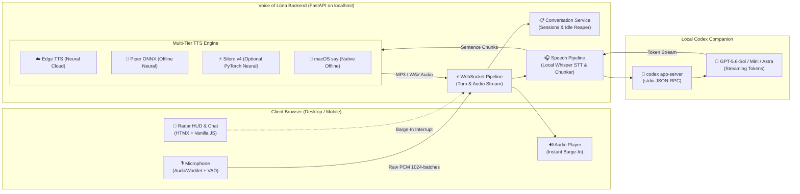

<p align="center">
  
</p>

<h1 align="center">Voice of Lúna</h1>

<p align="center">
  <strong>Personal, local-first voice bridge to OpenAI Codex via local stdio JSON-RPC</strong><br>
  <em>Streaming speech pipeline, local speech-to-text, multi-tier neural TTS, and instant barge-in.</em>
</p>

<p align="center">
  <a href="https://github.com/explesy/voice-of-luna/actions/workflows/ci.yml"></a>
  
  
  
  
  
  <a href="LICENSE"></a>
</p>

---

## 🌒 Overview

**Voice of Lúna** is a personal, open-source, local-first voice companion. It bridges your browser microphone directly to top-tier OpenAI models through your existing, already-authenticated local **Codex CLI** (`codex app-server`), keeping the intelligence in the high-reasoning text domain while delivering an ultra-responsive, natural voice conversation loop.

Unlike traditional cloud voice assistants that upload unencrypted voice recordings, bill you for expensive audio tokens, or force rigid robotic turn-taking, Voice of Lúna runs its audio capture and speech recognition locally on your own machine.

### Why Voice of Lúna?

- 🔒 **Local audio processing by default**: Speech recognition runs with local Whisper. Raw recordings are temporary and are not persisted by the application.
- 🔑 **Uses the local Codex login**: Communicates with your authenticated local Codex session (`codex login`) via stdio JSON-RPC. Turns still use the account's available Codex allowance; this is not an unlimited API or a public multi-user login.
- ⚡ **Streaming Sentence-Level TTS**: The first completed speech clause is sent to synthesis while the model continues generating the rest of its reply.
- 🛑 **True Natural Barge-In**: Interrupt Lúna at any moment simply by speaking or pressing `[Space]`. Audio playback stops instantly, queues are flushed, and a new turn begins.
- 🎙️ **Multi-Tier Voice Engine**: High-fidelity free cloud neural voices (Microsoft Edge TTS), ultra-fast offline neural voices (Silero TTS v4), and native macOS speech with automatic graceful fallback.
- 🌙 **Cyber-Tarot Dark Aesthetic**: Server-rendered HTMX interface with interactive Radar HUD, dynamic pulse core, millisecond telemetry readouts, and collapsible transcripts.

---

## 🏛️ Architecture



---

## ✨ Features

### 1. Measured Voice Loop (TTFA)
In conversational interfaces, **Time To First Audio (TTFA)** is what creates the feeling of a genuine dialogue. Voice of Lúna features an early-extraction streaming pipeline:
- As soon as the model outputs an opening clause (3+ words ending in `,`, `:`, `—`, `.`), it is immediately dispatched to the TTS synthesis queue.
- You hear the assistant start speaking while subsequent sentences are generated and synthesized in parallel.
- The HUD separates VAD endpointing, browser audio encoding, server preparation, STT, first LLM delta, TTS, and browser audio-render start so a slow turn can be diagnosed rather than guessed.

### 2. Multi-Tier Speech Synthesis (TTS)
Switch voices on the fly with automatic multi-tier fallback:

| Engine | Tier | Description |
|:---|:---:|:---|
| **Piper TTS ONNX** | 🚀 Offline Neural | Local ONNX neural voices (`Dmitri`, `Irina`, `Lessac`) with a small runtime footprint. |
| **Silero TTS v4** | ⚡ Offline Neural | Optional PyTorch neural voices (`Eugene`, `Ksenia`, `Baya`), fully offline. |
| **Microsoft Edge TTS** | ☁️ Cloud Neural | Natural cloud voices (`Svetlana`, `Dmitry`, `Jenny`); network variability is measured separately. |
| **macOS say** | 🍏 Native Offline | System-level offline fallback (`Milena`, `Samantha`). |

### 3. Client-Side VAD & Instant Barge-In
- **Continuous Voice Activity Detection (VAD)** automatically detects when you stop speaking (450ms silence endpointing) and triggers processing without manual clicks.
- **Barge-in**: Speak or click the Radar HUD while the assistant is talking, and playback cuts off within milliseconds, cancelling remaining synthesis tasks.

To compare VAD endpointing profiles on captured traces, run `npm run experiment:vad -- scripts/vad-traces.example.json`. The harness reports endpoint and false-end counts for fast (300 ms), normal (450 ms), and patient (600 ms) settings. Built-in traces are synthetic calibration data, not a latency SLA.

For an opt-in local browser capture, run `setVadTraceCapture(true)` in DevTools before speaking. The trace stores only timestamps, normalized volume, threshold, speech state, silence start, and stop/restart markers; it never stores audio or transcripts. Export it with `downloadVadTrace()`, then disable capture with `setVadTraceCapture(false)`.

### 4. Live Codex Discovery & Warmup
- **Dynamic Model Discovery**: Queries `/api/models` directly from your local Codex runtime and only displays models available to the current Codex sign-in.
- **Adjustable Reasoning**: Configure reasoning effort (`low`, `medium`, `high`) per session.
- **Hidden Warmup (`WARM: ON/OFF`)**: Executes an invisible one-turn background ping when opening a session. It may reduce first-turn thread latency, but consumes a short Codex turn and does not guarantee a fixed response time.

> GPT-5.4 and GPT-5.4 Mini retired from Codex sessions authenticated with ChatGPT on 31 August 2026. They are not shown in the live picker. The retirement does not apply to Codex authenticated with an OpenAI API key.

### 5. Trusted In-Process Plugins
Extend Lúna through trusted, in-process packages. The host exposes capability-oriented contexts and does not intentionally grant plugins raw audio or credentials, but Python entry-point plugins are not a security sandbox:
- **`Lúna (Core)`**: Neutral conversation core with no plugin tools.
- **`Project Room`**: Persistent plugin-scoped memory, read-only access to a user-selected project root, and optional GitHub issue tools. Repository reads are constrained to the selected root; GitHub issue creation requires a one-shot approval.

The core does not embed a personal-training protocol. Specialized workflows remain a future plugin concern.

---

## 📊 Performance evidence

The canonical methodology and dated results live in
[`docs/05 — Latency & Performance Benchmarks.md`](docs/05%20%E2%80%94%20Latency%20&%20Performance%20Benchmarks.md).
It distinguishes reproducible local TTS, opt-in network Edge TTS, private
real-speech STT, and quota-consuming live Codex observations. Do not treat a
single machine's snapshot as an SLA or a universal model ranking.

### Latest measured snapshot

These are point-in-time results, not a product guarantee. TTS rows are seven
warm samples after an excluded warm-up; all requested engines were actually
used (no fallback). The p95 is the largest of seven observations, so it shows
spread rather than a stable tail percentile.

| Voice | Engine | First chunk, median | Full sentence, median | Range across both measurements |
|---|---|---:|---:|---:|
| Eugene | Silero | **833.6 ms** | **861.3 ms** | 363.6–1450.8 ms |
| Ksenia | Silero | 331.5 ms | 1157.8 ms | 278.4–3540.0 ms |
| Baya | Silero | 713.3 ms | 1001.6 ms | 457.1–1219.8 ms |
| Aidar | Silero | 479.8 ms | 897.0 ms | 397.5–908.9 ms |
| Dmitri | Piper | 418.2 ms | 1432.1 ms | 342.0–1610.3 ms |
| Irina | Piper | 730.0 ms | 1528.9 ms | 542.4–1881.5 ms |
| Milena | macOS say | 2107.1 ms | 2020.0 ms | 934.7–3608.7 ms |
| Svetlana | Edge | 770.1 ms | 769.6 ms | 605.9–1063.1 ms |

STT was also checked with a private real Russian speech recording: transcription
returned non-empty speech in **864 ms**. The audio and transcript are not
stored in this repository; no accuracy claim is made without a reference text.

Live Codex latency is the dominant variable. The table below is one explicit
observation per state: `cold` is the first turn on a new thread, and `warm` is
the immediately following turn on that same thread. Values are TTFT / full-turn
milliseconds.

| Model | Cold | Warm |
|---|---:|---:|
| GPT-6-Astra | 6304.0 / 6603.1 | 4958.5 / 6392.1 |
| GPT-5.6-Sol | 6123.6 / 6341.8 | 2978.0 / 3553.9 |
| GPT-5.6-Terra | 5553.8 / 5755.9 | 2760.6 / 3048.7 |
| GPT-5.6-Luna | 4108.8 / 4291.6 | **2325.3 / 2525.2** |
| GPT-5.5 | 5396.0 / 6292.6 | 3647.2 / 3855.2 |

The live picker returned these five models; GPT-5.4 and GPT-5.4 Mini are no
longer available in this Codex session and are retained only in historical
documentation. Every warm observation was faster in this run. This supports
optional warmup, but not a fixed latency promise or a permanent model ranking. See the
[full methodology and limits](docs/05%20%E2%80%94%20Latency%20&%20Performance%20Benchmarks.md)
before making a configuration decision.

---

## 🚀 Getting Started

### Prerequisites

1. **macOS** or **Linux** with **Python 3.12+**.
2. [**uv**](https://docs.astral.sh/uv/) (modern, fast Python package manager).
3. **ffmpeg** and **whisper.cpp** for local speech recognition.
4. **OpenAI Codex CLI** signed in (`codex login`).

### Step 1: Install Audio Dependencies

On macOS with Homebrew:
```bash
brew install ffmpeg whisper-cpp
```

### Step 2: Download Local Whisper Model

Download the recommended multilingual Whisper model (GGML small, ~465 MB):
```bash
mkdir -p data/models
curl -L --retry 3 https://huggingface.co/ggerganov/whisper.cpp/resolve/main/ggml-small.bin \
  -o data/models/ggml-small.bin
```
*(The `data/` directory is git-ignored).*

### Step 3: Clone & Install
 
```bash
git clone https://github.com/explesy/voice-of-luna.git
cd voice-of-luna
make setup
```
*(Standard lightweight install without heavy PyTorch. Includes Piper ONNX, Edge TTS, and macOS say).*

To also enable **Silero PyTorch v4** voices:
```bash
make setup-silero
```
*(Or using `uv` directly: `cd backend && uv sync --extra silero`)*

### Step 4: Launch Voice of Lúna

```bash
make run
```
*(Or `cd backend && uv run uvicorn app.main:app --reload`)*

Open your browser at **[http://127.0.0.1:8000](http://127.0.0.1:8000)**.

---

## 🎮 Interface & Controls

<p align="center">
  <br>
  <strong>Cyber-Tarot Radar Console</strong>
</p>

| Input / Control | Action |
|:---|:---|
| **Click Radar HUD** | Toggle recording on / off |
| **[Space]** | Push-to-talk / toggle microphone |
| **Speak during playback** | Instant barge-in: interrupts assistant speech immediately |
| **[Escape]** | Stop playback / reset audio state |
| **Voice Selector** | Choose between Edge Neural, Silero Offline Neural, or macOS system voices |
| **Model & Reasoning** | Select Codex model and toggle reasoning effort (`low`, `med`, `high`) |
| **WARM: ON/OFF** | Optionally pre-warm a Codex thread; uses one short background turn and may reduce first-turn latency |
| **Prompt Input Dock** | Fallback text input dock for hybrid typing & voice interaction |

---

## ⚙️ Configuration

Voice of Lúna works out of the box with zero configuration, but can be customized via environment variables:

| Variable | Default | Description |
|:---|:---|:---|
| `VOICE_OF_LUNA_WHISPER_MODEL` | `data/models/ggml-small.bin` | Absolute path to the Whisper GGML model file |
| `VOICE_OF_LUNA_WHISPER_LANGUAGE` | `ru` | Language code for transcription (`ru`, `en`, `auto`) |
| `VOICE_OF_LUNA_WHISPER_SERVER` | `true` | Enable persistent background `whisper-server` process |
| `VOICE_OF_LUNA_WHISPER_HOST` | `127.0.0.1` | Local Whisper server host |
| `VOICE_OF_LUNA_WHISPER_PORT` | `8089` | Local Whisper server port |
| `VOICE_OF_LUNA_RUSSIAN_VOICE` | `Milena (Enhanced)` | Default macOS speech voice |
| `VOICE_OF_LUNA_MODELS_DIR` | `backend/models` (fallback: `~/.cache/voice-of-luna/models`) | Directory for downloaded Piper/Silero model artifacts |
| `VOICE_OF_LUNA_PLUGIN_DB` | `data/voice_of_luna_plugins.sqlite3` | Local SQLite file for plugin-scoped memory |
| `VOICE_OF_LUNA_PROJECT_ROOT` | unset | Optional default project root for Project Room read-only tools |
| `VOICE_OF_LUNA_GITHUB_REPOSITORY` | unset | Local `owner/repository` target for Project Room GitHub tools |
| `VOICE_OF_LUNA_GITHUB_TOKEN` | unset | Local GitHub token; never sent to the browser or plugin code |
| `VOICE_OF_LUNA_CONVERSATION_IDLE_TTL_SECONDS` | `900` | Inactivity timeout before reclaiming idle Codex threads (15 min) |

---

## 🧪 Testing & Verification

The comprehensive Python test suite currently collects 234 unit and integration tests. It runs offline with mocked model calls — running tests will **never consume your Codex quota**:
 
```bash
make test
```
Or:
```bash
cd backend
uv run pytest -q
```

To run the local TTS benchmark (seven warm samples per phrase; no Codex quota
and no Edge network request):
```bash
make matrix
```

Pass `--include-edge` explicitly for the network-backed Edge TTS experiment,
and `--stt-fixture /absolute/path/to/licensed-speech.wav` for an STT experiment
with real speech. See [the benchmark methodology](docs/05%20%E2%80%94%20Latency%20%26%20Performance%20Benchmarks.md).

To verify version synchronization (SemVer single source of truth):
```bash
cd backend
uv run pytest tests/test_version.py
```

---

## 🔒 Security & Privacy Model

- **Localhost Boundary**: Voice of Lúna binds exclusively to `127.0.0.1`. It is designed as a personal companion, never to be exposed directly to the public internet without an authentication layer.
- **No Token Storage**: The application never copies or exposes your OAuth credentials. All LLM calls pass through the local `codex app-server` binary already authorized on your machine.
- **Ephemeral Audio Lifecycle**: Recorded audio chunks, temporary WAV conversions, and synthesized reply audio are wiped immediately after turn delivery.
- **Trusted Plugins**: Plugins run in restricted turn contexts and are not intentionally given credentials or raw audio. They execute in the Luna Python process, so this is not a sandbox; Project Room's repository tools can read only the selected project root and never write repository files.

---

## 📚 Documentation

For in-depth architectural and product specifications, explore the [`docs/`](docs/) directory:

- [**00 — Project Overview**](docs/00%20%E2%80%94%20PROJECT%20README.md): High-level mission and product decisions.
- [**01 — Product & UX Spec**](docs/01%20%E2%80%94%20Product%20&%20UX%20Spec.md): User experience design, telemetry, and states.
- [**02 — Technical Architecture**](docs/02%20%E2%80%94%20Technical%20Architecture.md): Audio pipeline, WebSocket protocol, and process lifecycles.
- [**03 — Conversation Protocol**](docs/03%20%E2%80%94%20Conversation%20Protocol.md): Turn-taking rules, silence handling, and barge-in guarantees.
- [**04 — Implementation Plan**](docs/04%20%E2%80%94%20MVP%20&%20Implementation%20Plan.md): Milestone roadmap and quality gates.
- [**05 — Latency & Performance Benchmarks**](docs/05%20%E2%80%94%20Latency%20&%20Performance%20Benchmarks.md): Measurement methodology, dated evidence, and limits.

---

## 🤝 Contributing

Contributions are welcome! Please read [CONTRIBUTING.md](CONTRIBUTING.md) and [AGENTS.md](AGENTS.md) before opening an issue or submitting a pull request.

For security vulnerabilities, please refer to [SECURITY.md](SECURITY.md).

---

## 📄 License

Voice of Lúna is licensed under the [MIT License](LICENSE).
