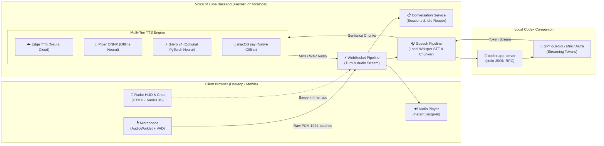

<p align="center">
  
</p>

<h1 align="center">Voice of Lúna</h1>

<p align="center">
  <strong>Personal, local-first voice bridge to OpenAI Codex via local stdio JSON-RPC</strong><br>
  <em>Streaming speech pipeline, local speech-to-text, multi-tier neural TTS, and instant barge-in.</em>
</p>

<p align="center">
  <a href="https://github.com/explesy/voice-of-luna/actions/workflows/ci.yml"></a>
  
  
  
  
  
  <a href="LICENSE"></a>
</p>

---

## 🌒 Overview

**Voice of Lúna** is a personal, open-source, local-first voice companion. It bridges your browser microphone directly to top-tier OpenAI models through your existing, already-authenticated local **Codex CLI** (`codex app-server`), keeping the intelligence in the high-reasoning text domain while delivering an ultra-responsive, natural voice conversation loop.

Unlike traditional cloud voice assistants that upload unencrypted voice recordings, bill you for expensive audio tokens, or force rigid robotic turn-taking, Voice of Lúna runs its audio capture and speech recognition locally on your own machine.

### Why Voice of Lúna?

- 🔒 **Zero Audio Leakage & Total Privacy**: Speech recognition runs entirely offline with local Whisper. Your raw voice recordings never leave your machine.
- 🔑 **No Extra API Keys or Costs**: Communicates directly with your authenticated local Codex session (`codex login`) via stdio JSON-RPC. No pay-per-token API billing or additional third-party subscriptions.
- ⚡ **Streaming Sentence-Level TTS**: The first completed speech clause is sent to synthesis while the model continues generating the rest of its reply.
- 🛑 **True Natural Barge-In**: Interrupt Lúna at any moment simply by speaking or pressing `[Space]`. Audio playback stops instantly, queues are flushed, and a new turn begins.
- 🎙️ **Multi-Tier Voice Engine**: High-fidelity free cloud neural voices (Microsoft Edge TTS), ultra-fast offline neural voices (Silero TTS v4), and native macOS speech with automatic graceful fallback.
- 🌙 **Cyber-Tarot Dark Aesthetic**: Server-rendered HTMX interface with interactive Radar HUD, dynamic pulse core, millisecond telemetry readouts, and collapsible transcripts.

---

## 🏛️ Architecture



---

## ✨ Features

### 1. Measured Voice Loop (TTFA)
In conversational interfaces, **Time To First Audio (TTFA)** is what creates the feeling of a genuine dialogue. Voice of Lúna features an early-extraction streaming pipeline:
- As soon as the model outputs an opening clause (3+ words ending in `,`, `:`, `—`, `.`), it is immediately dispatched to the TTS synthesis queue.
- You hear the assistant start speaking while subsequent sentences are generated and synthesized in parallel.
- The HUD separates VAD endpointing, browser audio encoding, server preparation, STT, first LLM delta, TTS, and browser audio-render start so a slow turn can be diagnosed rather than guessed.

### 2. Multi-Tier Speech Synthesis (TTS)
Switch voices on the fly with automatic multi-tier fallback:

| Engine | Tier | Description |
|:---|:---:|:---|
| **Piper TTS ONNX** | 🚀 Offline Neural | Local ONNX neural voices (`Dmitri`, `Irina`) with a small runtime footprint. |
| **Silero TTS v4** | ⚡ Offline Neural | Optional PyTorch neural voices (`Eugene`, `Ksenia`, `Baya`), fully offline. |
| **Microsoft Edge TTS** | ☁️ Cloud Neural | Natural cloud voices (`Svetlana`, `Dmitry`, `Jenny`); network variability is measured separately. |
| **macOS say** | 🍏 Native Offline | System-level offline fallback (`Milena`, `Samantha`). |

### 3. Client-Side VAD & Instant Barge-In
- **Continuous Voice Activity Detection (VAD)** automatically detects when you stop speaking (450ms silence endpointing) and triggers processing without manual clicks.
- **Barge-in**: Speak or click the Radar HUD while the assistant is talking, and playback cuts off within milliseconds, cancelling remaining synthesis tasks.

To compare VAD endpointing profiles on captured traces, run `npm run experiment:vad -- scripts/vad-traces.example.json`. The harness reports endpoint and false-end counts for fast (300 ms), normal (450 ms), and patient (600 ms) settings. Built-in traces are synthetic calibration data, not a latency SLA.

### 4. Live Codex Discovery & Warmup
- **Dynamic Model Discovery**: Queries `/api/models` directly from your local Codex runtime (`gpt-5.6-sol`, `gpt-5.4-mini`, `gpt-5.6-terra`, `gpt-6-astra`).
- **Adjustable Reasoning**: Configure reasoning effort (`low`, `medium`, `high`) per session.
- **Hidden Warmup (`WARM: ON/OFF`)**: Executes an invisible one-turn background ping when opening a session. It may reduce first-turn thread latency, but consumes a short Codex turn and does not guarantee a fixed response time.

### 5. Capability-Isolated Plugins
Extend Lúna's capabilities without granting plugins access to credentials or raw audio:
- **`Lúna (Core)`**: Neutral, empathetic conversation core.
- **`Focus Sprint`**: Timed Pomodoro-style sprints with progress check-ins.
- **`Spanish Buddy`**: Conversational Spanish language tutor.

---

## 📊 Performance evidence

The canonical methodology and dated results live in
[`docs/05 — Latency & Performance Benchmarks.md`](docs/05%20%E2%80%94%20Latency%20&%20Performance%20Benchmarks.md).
It distinguishes reproducible local TTS, opt-in network Edge TTS, private
real-speech STT, and quota-consuming live Codex observations. Do not treat a
single machine's snapshot as an SLA or a universal model ranking.

### Latest measured snapshot

These are point-in-time results, not a product guarantee. TTS rows are seven
warm samples after an excluded warm-up; all requested engines were actually
used (no fallback). The range is min–max.

| Voice | Engine | First chunk, median | Full sentence, median | Range across both measurements |
|---|---|---:|---:|---:|
| Eugene | Silero | **80.2 ms** | **237.1 ms** | 67.3–255.6 ms |
| Ksenia | Silero | 154.1 ms | 272.4 ms | 105.0–1800.4 ms |
| Dmitri | Piper | 402.2 ms | 908.2 ms | 240.2–958.2 ms |
| Irina | Piper | 471.7 ms | 1213.6 ms | 413.7–1280.2 ms |
| Milena | macOS say | 1356.7 ms | 1396.4 ms | 1309.1–1452.1 ms |
| Svetlana | Edge | 975.1 ms | 889.7 ms | 701.5–3813.9 ms |

STT was also checked with a private real Russian speech recording: transcription
returned non-empty speech in **864 ms**. The audio and transcript are not
stored in this repository; no accuracy claim is made without a reference text.

Live Codex latency is the dominant variable. The table below is one explicit
observation per state: `cold` is the first turn on a new thread, and `warm` is
the immediately following turn on that same thread. Values are TTFT / full-turn
milliseconds.

| Model | Cold | Warm |
|---|---:|---:|
| GPT-5.4-Mini | 6098 / 6391 | 4801 / 5097 |
| GPT-5.6-Sol | 6495 / 6835 | 3854 / 4187 |
| GPT-5.6-Terra | 5552 / 5706 | **2132 / 2549** |
| GPT-5.6-Luna | 6479 / 6708 | 3968 / 4726 |
| GPT-5.5 | 5404 / 5447 | 3660 / 3664 |
| GPT-6-Astra | 6463 / 6845 | 3786 / 4144 |

Every warm observation was faster in this run. This supports optional warmup,
but not a fixed latency promise or a permanent model ranking. See the
[full methodology and limits](docs/05%20%E2%80%94%20Latency%20&%20Performance%20Benchmarks.md)
before making a configuration decision.

---

## 🚀 Getting Started

### Prerequisites

1. **macOS** or **Linux** with **Python 3.12+**.
2. [**uv**](https://docs.astral.sh/uv/) (modern, fast Python package manager).
3. **ffmpeg** and **whisper.cpp** for local speech recognition.
4. **OpenAI Codex CLI** signed in (`codex login`).

### Step 1: Install Audio Dependencies

On macOS with Homebrew:
```bash
brew install ffmpeg whisper-cpp
```

### Step 2: Download Local Whisper Model

Download the recommended multilingual Whisper model (GGML small, ~465 MB):
```bash
mkdir -p data/models
curl -L --retry 3 https://huggingface.co/ggerganov/whisper.cpp/resolve/main/ggml-small.bin \
  -o data/models/ggml-small.bin
```
*(The `data/` directory is git-ignored).*

### Step 3: Clone & Install
 
```bash
git clone https://github.com/explesy/voice-of-luna.git
cd voice-of-luna
make setup
```
*(Standard lightweight install without heavy PyTorch. Includes Piper ONNX, Edge TTS, and macOS say).*

To also enable **Silero PyTorch v4** voices:
```bash
make setup-silero
```
*(Or using `uv` directly: `cd backend && uv sync --extra silero`)*

### Step 4: Launch Voice of Lúna

```bash
make run
```
*(Or `cd backend && uv run uvicorn app.main:app --reload`)*

Open your browser at **[http://127.0.0.1:8000](http://127.0.0.1:8000)**.

---

## 🎮 Interface & Controls

<p align="center">
  <br>
  <strong>Cyber-Tarot Radar Console</strong>
</p>

| Input / Control | Action |
|:---|:---|
| **Click Radar HUD** | Toggle recording on / off |
| **[Space]** | Push-to-talk / toggle microphone |
| **Speak during playback** | Instant barge-in: interrupts assistant speech immediately |
| **[Escape]** | Stop playback / reset audio state |
| **Voice Selector** | Choose between Edge Neural, Silero Offline Neural, or macOS system voices |
| **Model & Reasoning** | Select Codex model and toggle reasoning effort (`low`, `med`, `high`) |
| **WARM: ON/OFF** | Optionally pre-warm a Codex thread; uses one short background turn and may reduce first-turn latency |
| **Prompt Input Dock** | Fallback text input dock for hybrid typing & voice interaction |

---

## ⚙️ Configuration

Voice of Lúna works out of the box with zero configuration, but can be customized via environment variables:

| Variable | Default | Description |
|:---|:---|:---|
| `VOICE_OF_LUNA_WHISPER_MODEL` | `data/models/ggml-small.bin` | Absolute path to the Whisper GGML model file |
| `VOICE_OF_LUNA_WHISPER_LANGUAGE` | `ru` | Language code for transcription (`ru`, `en`, `auto`) |
| `VOICE_OF_LUNA_WHISPER_SERVER` | `true` | Enable persistent background `whisper-server` process |
| `VOICE_OF_LUNA_WHISPER_HOST` | `127.0.0.1` | Local Whisper server host |
| `VOICE_OF_LUNA_WHISPER_PORT` | `8089` | Local Whisper server port |
| `VOICE_OF_LUNA_RUSSIAN_VOICE` | `Milena (Enhanced)` | Default macOS speech voice |
| `VOICE_OF_LUNA_CONVERSATION_IDLE_TTL_SECONDS` | `900` | Inactivity timeout before reclaiming idle Codex threads (15 min) |

---

## 🧪 Testing & Verification

The comprehensive test suite contains 198+ unit and integration tests running completely offline with 100% mocked model calls — running tests will **never consume your Codex quota**:
 
```bash
make test
```
Or:
```bash
cd backend
uv run pytest -q
```

To run the local TTS benchmark (seven warm samples per phrase; no Codex quota
and no Edge network request):
```bash
make matrix
```

Pass `--include-edge` explicitly for the network-backed Edge TTS experiment,
and `--stt-fixture /absolute/path/to/licensed-speech.wav` for an STT experiment
with real speech. See [the benchmark methodology](docs/05%20%E2%80%94%20Latency%20%26%20Performance%20Benchmarks.md).

To verify version synchronization (SemVer single source of truth):
```bash
cd backend
uv run pytest tests/test_version.py
```

---

## 🔒 Security & Privacy Model

- **Localhost Boundary**: Voice of Lúna binds exclusively to `127.0.0.1`. It is designed as a personal companion, never to be exposed directly to the public internet without an authentication layer.
- **No Token Storage**: The application never touches, reads, or caches your OAuth credentials. All LLM calls pass through the local `codex app-server` binary already authorized on your machine.
- **Ephemeral Audio Lifecycle**: Recorded audio chunks, temporary WAV conversions, and synthesized reply audio are wiped immediately after turn delivery.
- **Isolated Plugins**: Plugins run in restricted turn contexts and have no access to file systems, credentials, or raw audio data.

---

## 📚 Documentation

For in-depth architectural and product specifications, explore the [`docs/`](docs/) directory:

- [**00 — Project Overview**](docs/00%20%E2%80%94%20PROJECT%20README.md): High-level mission and product decisions.
- [**01 — Product & UX Spec**](docs/01%20%E2%80%94%20Product%20&%20UX%20Spec.md): User experience design, telemetry, and states.
- [**02 — Technical Architecture**](docs/02%20%E2%80%94%20Technical%20Architecture.md): Audio pipeline, WebSocket protocol, and process lifecycles.
- [**03 — Conversation Protocol**](docs/03%20%E2%80%94%20Conversation%20Protocol.md): Turn-taking rules, silence handling, and barge-in guarantees.
- [**04 — Implementation Plan**](docs/04%20%E2%80%94%20MVP%20&%20Implementation%20Plan.md): Milestone roadmap and quality gates.
- [**05 — Latency & Performance Benchmarks**](docs/05%20%E2%80%94%20Latency%20&%20Performance%20Benchmarks.md): Measurement methodology, dated evidence, and limits.

---

## 🤝 Contributing

Contributions are welcome! Please read [CONTRIBUTING.md](CONTRIBUTING.md) and [AGENTS.md](AGENTS.md) before opening an issue or submitting a pull request.

For security vulnerabilities, please refer to [SECURITY.md](SECURITY.md).

---

## 📄 License

Voice of Lúna is licensed under the [MIT License](LICENSE).
